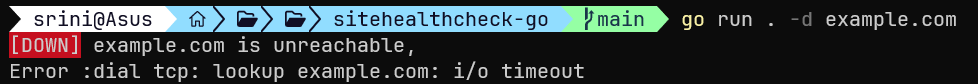

# sitehealthcheck-go

A simple health checker for websites written in Go


## Requirements 
- Go Compiler
- Functioning Network
## Install and Run
Clone the repository
```
git clone https://github.com/SrinivasSKulal/sitehealthcheck-go.git
```
cd into it and install the dependencies
```
cd sitehealthcheck-go
go mod tidy
```
run the program

```
go run . -d example.com
```
Replace example.com with the website you want to test


## Help

```
   --domain value, -d value  Domain name to check.      
   --port value, -p value    Port number to check health
   --help, -h                show help
```
## Output example



